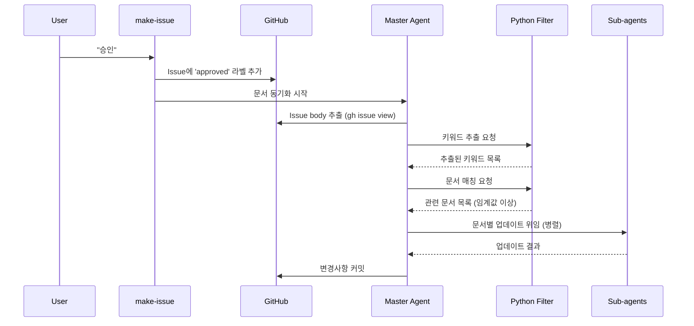
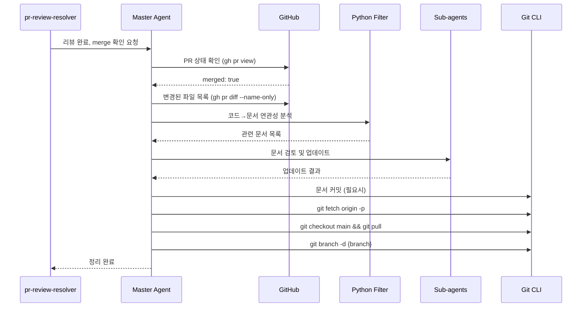

# 도메인 문서 동기화 파이프라인 설계

## 개요

기획 승인 및 PR merge 시 docs/spec 문서를 자동으로 동기화하는 AI 에이전트 파이프라인.

## 핵심 원칙

1. **Context 절약**: 불필요한 데이터는 Python script로 사전 필터링
2. **단계적 처리**: Step-by-step으로 필요한 정보만 추출
3. **병렬 처리**: 독립적인 작업은 sub-agent로 병렬 수행

---

## 파이프라인 1: 기획 승인 후 문서 동기화

### 트리거 조건
- GitHub Issue에 `approved` 라벨 추가 시
- make-issue 피드백 루프 완료 후 자동으로 라벨 추가



### Step 1: Issue 정보 추출 (Code Level)

**Input**: Issue number
**Output**: 정제된 키워드 목록

```python
# scripts/extract_issue_keywords.py
"""
Issue body에서 핵심 키워드/개념 추출

Pre-processing:
1. gh issue view {number} --json body,title,labels로 데이터 추출
2. Markdown 파싱하여 섹션별 분리
3. 불필요한 템플릿 텍스트 제거 (체크박스, 구분선 등)

Post-processing:
1. 도메인 용어 사전 기반 키워드 매칭
2. 새로운 개념/용어 식별
3. 카테고리 분류 (domain/infra/frontend/design)
"""

DOMAIN_KEYWORDS = {
    "domain": ["lecture", "session", "subscription", "folder", "ticket", "plan",
               "접근권한", "구독", "강의", "세션", "재생목록", "티켓"],
    "infrastructure": ["cloudflare", "minio", "streaming", "video", "signed url",
                       "스트리밍", "비디오", "인프라"],
    "frontend": ["player", "component", "ui", "플레이어", "컴포넌트"],
    "design": ["color", "token", "theme", "색상", "토큰", "디자인"]
}

def extract_keywords(issue_body: str) -> dict:
    """
    Returns:
        {
            "domain": ["lecture", "ticket", ...],
            "infrastructure": [],
            "frontend": ["player"],
            "design": [],
            "new_concepts": ["새로운 개념1", ...]
        }
    """
    pass
```

### Step 2: 관련 문서 필터링 (Code Level)

**Input**: 추출된 키워드
**Output**: 관련 문서 목록 + 매칭 점수

```python
# scripts/filter_related_docs.py
"""
docs/spec 문서들과 키워드 매칭

Pre-processing:
1. docs/spec/**/*.md 파일 목록 수집
2. 각 문서에서 헤더(#, ##, ###)만 추출
3. 문서별 키워드 인덱스 생성

Post-processing:
1. Issue 키워드와 문서 키워드 매칭률 계산
2. 임계값(0.3) 이상인 문서만 반환
3. 매칭된 섹션 정보 포함
"""

DOC_MAPPING = {
    "docs/spec/domain/lecture.md": {
        "keywords": ["lecture", "ticket", "접근권한", "강의", "티켓"],
        "headers": ["접근 권한", "티켓 차감 플로우", "무제한 구독"]
    },
    "docs/spec/domain/session.md": {
        "keywords": ["session", "type", "세션", "타입", "PLAY", "TALK"],
        "headers": ["Session 타입"]
    },
    # ... 나머지 문서들
}

def filter_docs(keywords: dict, threshold: float = 0.3) -> list[dict]:
    """
    Returns:
        [
            {
                "path": "docs/spec/domain/lecture.md",
                "score": 0.85,
                "matched_keywords": ["lecture", "ticket"],
                "matched_sections": ["티켓 차감 플로우"]
            },
            ...
        ]
    """
    pass
```

### Step 3: 변경 필요성 판단 (Master Agent)

**Input**: 필터링된 문서 목록 + Issue 요약
**Output**: 변경 대상 문서 + 변경 지침

```
Master Agent 프롬프트:

다음 Issue 기획서와 관련 문서 목록을 검토하여 각 문서의 변경 필요성을 판단하세요.

## Issue 요약
{issue_summary}  # 전체 body가 아닌 핵심 요약만 전달

## 관련 문서 (헤더만)
{doc_headers}  # 전체 내용이 아닌 헤더 구조만 전달

## 판단 기준
1. 새로운 개념 추가 필요
2. 기존 개념 변경/확장 필요
3. 예시/플로우 업데이트 필요
4. 변경 불필요 (기존 문서로 충분)

## 출력 형식
변경이 필요한 문서만 반환:
- path: 문서 경로
- reason: 변경 이유 (1줄)
- instructions: 구체적 변경 지침
```

### Step 4: 문서 업데이트 (Sub-agents 병렬 처리)

**Input**: 대상 문서 + 변경 지침 + Issue 관련 부분
**Output**: 업데이트된 문서 내용

```
Sub-agent 구성:

- subagent_type: "doc-updater"
- tools: [Read, Edit]
- max_context: 해당 문서 + 관련 Issue 섹션만

프롬프트:
다음 문서를 업데이트하세요.

## 대상 문서
{doc_path}

## 변경 지침
{instructions}

## 참조할 Issue 내용
{relevant_issue_section}  # 전체가 아닌 관련 섹션만

## 규칙
1. 기존 문서 구조 유지
2. 마크다운 형식 일관성
3. 새 섹션 추가 시 적절한 위치 선정
```

### Step 5: 변경사항 커밋 (Code Level)

```bash
# 변경된 문서들 커밋
git add docs/spec/
git commit -m "docs: Issue #{number} 기획 반영하여 spec 문서 업데이트

- {변경된 파일1}: {변경 요약}
- {변경된 파일2}: {변경 요약}

Refs: #{number}"
```

---

## 파이프라인 2: PR Merge 후 문서 동기화 + Git 정리

### 트리거 조건
- pr-review-resolver 완료 후
- PR이 merged 상태로 감지될 때



### Step 1: PR 상태 및 변경 파일 확인 (Code Level)

```python
# scripts/check_pr_status.py
"""
PR 상태 확인 및 변경 파일 분석

Pre-processing:
1. gh pr view --json state,mergedAt,headRefName 으로 상태 확인
2. gh pr diff --name-only 로 변경 파일 목록
3. 파일을 카테고리별 분류 (backend/frontend/docs/config)

Post-processing:
1. 변경된 코드 파일에서 도메인 관련 변경 식별
2. 관련 문서와 매핑
"""

CODE_TO_DOC_MAPPING = {
    # Backend 매핑
    "backend/app/domain/lecture/": "docs/spec/domain/lecture.md",
    "backend/app/domain/session/": "docs/spec/domain/session.md",
    "backend/app/domain/subscription/": "docs/spec/domain/subscription.md",
    "backend/app/domain/folder/": "docs/spec/domain/folder.md",
    # Frontend 매핑
    "frontend/src/lib/components/VideoPlayer": "docs/spec/frontend/video-player.md",
    # Infra 매핑
    "docker-compose": "docs/spec/infrastructure/video-streaming.md",
}

def analyze_pr_changes(pr_number: int) -> dict:
    """
    Returns:
        {
            "is_merged": True,
            "branch_name": "feature/xxx",
            "changed_files": ["backend/app/domain/lecture/service.py", ...],
            "related_docs": [
                {"path": "docs/spec/domain/lecture.md", "reason": "lecture 서비스 변경"}
            ]
        }
    """
    pass
```

### Step 2: 문서 최신화 필요성 검토 (Master Agent)

```
Master Agent 프롬프트:

다음 PR의 코드 변경사항과 관련 문서를 비교하여 문서 업데이트 필요성을 판단하세요.

## PR 정보
- 제목: {pr_title}
- 변경 파일: {changed_files}

## 관련 문서 현황
{doc_status}  # 각 문서의 최근 수정일 + 관련 섹션 헤더

## 판단 기준
1. 코드에서 새로운 기능/로직 추가 → 문서에 미반영
2. 기존 동작 방식 변경 → 문서와 불일치
3. API/인터페이스 변경 → 문서 예시 수정 필요

## 출력
변경 필요한 문서만 반환 (형식 동일)
```

### Step 3: 문서 업데이트 (파이프라인 1의 Step 4와 동일)

### Step 4: Git 정리 작업 (Code Level)

```bash
#!/bin/bash
# scripts/cleanup_after_merge.sh

set -e

BRANCH_NAME=$1

# 1. 원격 브랜치 삭제 상태 반영
git fetch origin -p

# 2. main으로 checkout
git checkout main

# 3. main 최신화
git pull origin main

# 4. 작업 완료된 로컬 브랜치 삭제
if git branch --list "$BRANCH_NAME" | grep -q "$BRANCH_NAME"; then
    git branch -d "$BRANCH_NAME"
    echo "Deleted local branch: $BRANCH_NAME"
fi

echo "Cleanup completed successfully"
```

---

## Agent 아키텍처

```
┌─────────────────────────────────────────────────────────────┐
│                      Master Agent                            │
│  - 전체 워크플로우 조율                                        │
│  - 단계별 진행 상황 관리                                       │
│  - Sub-agent 생성 및 결과 수집                                │
└─────────────────────────────────────────────────────────────┘
           │                    │                    │
           ▼                    ▼                    ▼
┌─────────────────┐  ┌─────────────────┐  ┌─────────────────┐
│  Python Scripts │  │  Sub-agent 1    │  │  Sub-agent 2    │
│  (Pre/Post)     │  │  doc-updater    │  │  doc-updater    │
│                 │  │                 │  │                 │
│ - 키워드 추출   │  │ lecture.md 담당 │  │ session.md 담당 │
│ - 문서 필터링   │  │                 │  │                 │
│ - 매칭률 계산   │  │ Tools:          │  │ Tools:          │
│ - Git 정리     │  │ - Read          │  │ - Read          │
│                 │  │ - Edit          │  │ - Edit          │
└─────────────────┘  └─────────────────┘  └─────────────────┘
```

### 역할 분담

| 컴포넌트 | 역할 | Context 소모 |
|---------|------|-------------|
| Master Agent | 워크플로우 조율, 판단 | 중간 (요약만 수신) |
| Python Scripts | 데이터 전처리/후처리 | 없음 (AI 미사용) |
| Sub-agents | 개별 문서 업데이트 | 낮음 (문서 1개씩) |

### Context 절약 전략

1. **Issue 처리**
   - ❌ 전체 Issue body 전달
   - ✅ 키워드 추출 후 요약만 전달

2. **문서 필터링**
   - ❌ 모든 문서를 AI에게 전달
   - ✅ 매칭률 기반 필터링 후 관련 문서만

3. **문서 내용 전달**
   - ❌ 전체 문서 내용
   - ✅ 헤더 구조만 → 판단 후 → 해당 섹션만

4. **병렬 처리**
   - ❌ 순차적으로 모든 문서 처리
   - ✅ 문서별 sub-agent로 병렬 처리

---

## 구현 파일 구조

```
.claude/
├── skills/
│   └── doc-sync/
│       ├── SKILL.md                    # Skill 정의
│       ├── scripts/
│       │   ├── extract_issue_keywords.py
│       │   ├── filter_related_docs.py
│       │   ├── check_pr_status.py
│       │   └── cleanup_after_merge.sh
│       └── references/
│           └── doc-mapping.json        # 코드↔문서 매핑 정보
├── subagents/
│   └── doc-updater.md                  # 문서 업데이트 sub-agent 정의
└── commands/
    └── make-issue.md                   # 기존 + 승인 시 라벨 추가 로직
```

---

## 다음 단계

1. [ ] Python 스크립트 구현 (extract_issue_keywords.py, filter_related_docs.py)
2. [ ] doc-updater sub-agent 정의
3. [ ] make-issue.md 수정 (승인 시 라벨 추가 + 문서 동기화 호출)
4. [ ] pr-review-resolver.md 수정 (merge 후 정리 작업 추가)
5. [ ] doc-mapping.json 작성 (코드↔문서 매핑)
