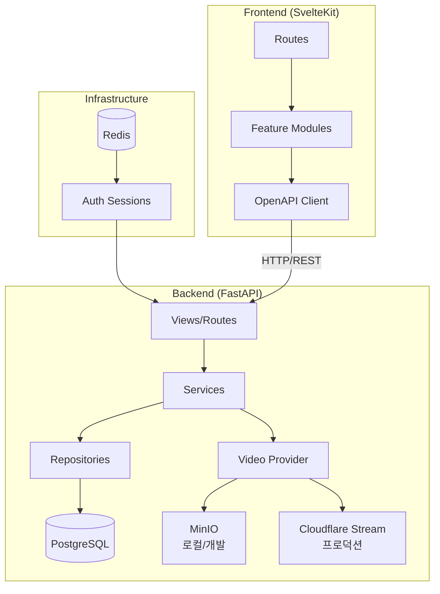

# Architecture

## 디렉토리 구조

```
sessionary/
├── backend/                  # Python FastAPI 백엔드
│   └── app/
│       ├── main.py           # FastAPI 앱 팩토리
│       ├── core/             # 설정, 로깅, 에러, 미들웨어
│       ├── db/               # DB 설정 + Alembic 마이그레이션
│       ├── containers/       # 의존성 주입 컨테이너
│       ├── auth/             # 인증 (fastapi-users, OAuth2, Redis 세션)
│       ├── user/             # 사용자 관리
│       ├── lecture/          # 렉처 도메인
│       ├── lesson/           # 레슨 도메인
│       ├── session/          # 세션 도메인 (5가지 타입)
│       ├── ticket/           # 티켓 시스템
│       ├── subscription/     # 구독 플랜
│       ├── video/            # 비디오 스트리밍 (Cloudflare/MinIO)
│       ├── playlist/         # 플레이리스트
│       └── ping/             # 헬스체크
├── frontend/                 # SvelteKit 프론트엔드
│   └── src/
│       ├── routes/           # 파일 기반 라우팅
│       └── lib/
│           ├── features/     # 기능별 모듈 (auth, lecture, session, ticket)
│           ├── components/   # 공유 UI 컴포넌트
│           ├── api/          # OpenAPI 생성 클라이언트
│           └── utils/        # 유틸리티
├── infra/                    # 인프라 설정
│   ├── dev/                  # Docker Compose (로컬 개발)
│   ├── staging/              # Fly.io 스테이징
│   └── prod/                 # 프로덕션
├── docs/                     # 프로젝트 문서
│   ├── domain/               # 도메인 문서 (이 디렉토리)
│   ├── spec/                 # 비즈니스 스펙
│   └── cc/                   # Claude Code 관련 문서
└── .github/workflows/        # CI/CD 파이프라인
```

## 모듈 관계도



## 데이터 흐름

### 요청 처리 흐름

```
Client → SvelteKit SSR/CSR
  → Axios (OpenAPI Client)
    → FastAPI (View)
      → Auth Middleware (Redis 세션 검증)
        → Service (비즈니스 로직)
          → Repository (SQLAlchemy ORM)
            → PostgreSQL
```

### 인증 흐름

```
1. Google OAuth2 → /user/oauth/google/authorize → 리다이렉트 URL 반환
2. Google 콜백 → /user/oauth/google/callback → Redis 세션 생성, 쿠키 설정
3. 이후 요청 → 쿠키의 세션 토큰 → Redis에서 사용자 조회
```

### 세션 접근 흐름

```
1. 렉처 페이지 → 세션 클릭
2. 미인증 → 로그인 모달 → OAuth → 콜백 → 원래 렉처로 복귀
3. 티켓 확인 → /ticket/lecture/{id} → 접근 가능 여부 반환
4. 티켓 사용 → /ticket/lecture/{id} POST → 1주 접근권 부여
5. 세션 상세 → /session/{id} → 비디오 URL + 자막 + 가이드 반환
```

## 주요 설계 결정

| 결정 | 선택 | 이유 |
|------|------|------|
| 인증 방식 | Redis 세션 쿠키 (JWT 아님) | 서버 측 세션 관리로 즉시 무효화 가능 |
| 비디오 스트리밍 | HLS (Cloudflare Stream) | 적응형 비트레이트, CDN 내장 |
| API 클라이언트 | OpenAPI 코드 생성 | 백엔드 스키마와 타입 자동 동기화 |
| 의존성 주입 | dependency-injector | 테스트 시 Mock 교체 용이 |
| 프론트엔드 반응성 | Svelte 5 Runes | 최신 반응성 모델, 명시적 상태 관리 |
| 배포 | Fly.io | 글로벌 엣지, 간편한 컨테이너 배포 |
