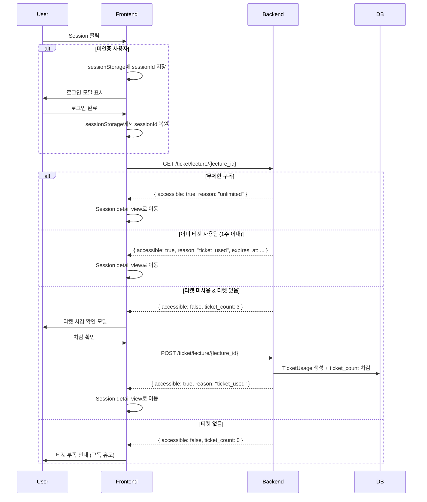

# Features

## 핵심 기능

### 기능 1: 렉처 시스템
- **설명**: 곡/주제별로 구성된 렉처(강의)를 탐색하고 시청하는 핵심 기능. 각 렉처는 약 10개의 세션으로 구성.
- **관련 파일**: `backend/app/lecture/`, `frontend/src/routes/lecture/[id]/`, `frontend/src/lib/features/lecture/`
- **API 엔드포인트**:
  - `GET /lecture` - 렉처 목록
  - `GET /lecture/{id}` - 렉처 상세 (레슨 목록 포함)

### 기능 2: 세션 (5가지 타입)
- **설명**: 렉처 내 개별 학습 단위. 타입에 따라 다른 레이아웃과 콘텐츠 제공.
- **세션 타입**:

| 타입 | 라벨 | 색상 | 설명 |
|------|------|------|------|
| PLAY | 연주 강의 | `#22C55E` | 연주 영상과 TAB 악보 제공 |
| TALK | 곡 해석 | `#3B82F6` | 연주 영상 및 나레이션 (영상 중심) |
| JAM | 리허설 | `#F59E0B` | 백업 트랙에 맞춰 연주 연습 |
| BASIC | 기본기 | `#8B5CF6` | 테크닉 기초 강의 |
| SHEET | 악보 | `#EC4899` | TAB/악보 이미지 모음 |

- **레이아웃 타입**:

| 레이아웃 | 구성 요소 | 적용 세션 타입 |
|----------|----------|---------------|
| Type 1 (Full Tutorial) | 비디오 + 자막 + 탭 악보 + 가이드 | PLAY, BASIC |
| Type 2 (Video Focus) | 비디오 + 자막 패널 | TALK |
| Type 3 (Practice) | 오디오 플레이어 + 탭 악보 | JAM, SHEET |

- **관련 파일**: `backend/app/session/`, `frontend/src/routes/session/[id]/`, `frontend/src/lib/features/session/`
- **API 엔드포인트**: `GET /session/{id}` - 세션 상세 (비디오 URL, 자막, 가이드 포함)

#### Session Detail API 응답 예시

```json
{
  "id": 1,
  "title": "아르페지오 인트로 마스터하기",
  "session_type": "PLAY",
  "session_type_label": "연주 강의",
  "lecture_ordering": 2,
  "length_sec": 168,
  "lecture": { "id": 1, "title": "Stairway to Heaven", "total_sessions": 10 },
  "video": { "url": "https://...", "type": "hls", "expires_at": "..." },
  "sheetmusic_url": "https://.../stairway.gp",
  "sync_offset": 0,
  "subtitles": [
    { "timestamp_ms": 0, "text": "이 파트에서는..." },
    { "timestamp_ms": 12000, "text": "Am 코드에서 시작해서..." }
  ],
  "playing_guide": [
    {
      "step": 1,
      "title": "코드 포지션 잡기",
      "description": "Am 코드 형태로 손가락을 배치...",
      "start_time": "0:00",
      "end_time": "0:28",
      "tip": "처음에는 코드를 천천히 잡고..."
    }
  ],
  "navigation": { "prev_session_id": null, "next_session_id": 2 }
}
```

### 기능 3: 비디오 스트리밍
- **설명**: HLS 적응형 비트레이트 스트리밍. 개발 환경은 MinIO, 프로덕션은 Cloudflare Stream 사용.
- **관련 파일**: `backend/app/video/`, `frontend/src/lib/features/session/components/VideoPlayer.svelte`
- **Provider 전환**: `VIDEO_PROVIDER` 환경변수로 `local`/`cloudflare` 선택

### 기능 4: 인증 (Google OAuth2)
- **설명**: Google OAuth2 기반 로그인. Redis 세션 쿠키로 인증 상태 관리.
- **흐름**: Google 인증 → 콜백 → Redis 세션 생성 → 쿠키 설정 → 인증된 API 호출
- **관련 파일**: `backend/app/auth/`, `frontend/src/routes/oauth-callback/`, `frontend/src/lib/features/auth/`
- **API 엔드포인트**:
  - `GET /user/oauth/google/authorize` - 인증 URL 생성
  - `GET /user/oauth/google/callback` - 콜백 처리
  - `GET /user/me` - 현재 사용자 정보

### 기능 5: 티켓 시스템
- **설명**: 렉처 접근을 위한 티켓 기반 과금 시스템. 티켓 1개로 1주일간 렉처 접근 가능.
- **관련 파일**: `backend/app/ticket/`, `frontend/src/lib/features/ticket/`
- **API 엔드포인트**:
  - `GET /ticket/lecture/{id}` - 접근 상태 확인
  - `POST /ticket/lecture/{id}` - 티켓 사용

#### 접근 권한 매트릭스

| 페이지 | 비로그인 | Ticket Plan | 무제한 구독 |
|--------|----------|-------------|-------------|
| Lecture 목록 | O | O | O |
| Lecture detail | O | O | O |
| Session detail | X (로그인 유도) | 티켓 차감 후 접근 | O |
| 비디오 재생 | X | 티켓 사용된 경우만 | O |

#### 티켓 차감 플로우



#### 미인증 사용자 처리
1. `sessionStorage.setItem('pendingSessionId', sessionId)`로 클릭한 Session ID 저장
2. 로그인 완료 후 `sessionStorage`에서 복원하여 티켓 차감 플로우 자동 재개
3. 처리 완료 후 `sessionStorage`에서 해당 값 제거

### 기능 6: 구독 플랜
- **설명**: 4가지 구독 플랜으로 접근 수준 차별화.
- **관련 파일**: `backend/app/subscription/`
- **규칙**: 가입 시 Ticket Plan 자동 생성. 한 사용자 = 하나의 Plan.

| Plan | 이용 범위 | 수명 | Folder | 비고 |
|------|----------|------|--------|------|
| Ticket | 주 3개 Lecture | 무제한 | X | 기본 플랜, 매주 크레딧 충전 |
| Experimental | 무제한 | 2주 | O | Personal 체험판, 직접 활성화 필요 |
| Personal | 무제한 | 결제 기간 | O | 기본 1개월 |
| Group | 무제한 | 결제 기간 | O | 다인 할인 적용 |

- **무제한 구독 판단**: `subscription.name` in [personal, group, experimental] AND `is_active` = true AND 미만료
- **결제 연동**: Toss 기준 - 클라이언트 결제 완료 후 confirm API 호출
- **구독 취소**: 이력 hard delete 안 함, 갱신 시 새 subscription 생성

### 기능 7: Folder (커스텀 재생목록)
- **설명**: 여러 Lecture의 Session들을 사용자가 원하는 대로 모아 구성하는 커스텀 재생목록.
- **규칙**: Experimental Plan 이상만 이용 가능. 사용자별 여러 개 생성 가능.
- **사용 예시**: 특정 테크닉 모음, 하이라이트 세션 모음, 난이도별 커리큘럼
- **관련 파일**: `backend/app/playlist/`, `frontend/src/routes/folder/`

## 도메인 개념

### Lecture (렉처)
곡이나 주제를 기반으로 한 강의 묶음. 하나의 렉처에 약 10개의 세션이 포함되며, 아티스트가 제작.

### Session (세션)
렉처 내 개별 학습 단위. 5가지 타입(PLAY, TALK, JAM, BASIC, SHEET)으로 구분되며 각각 고유한 레이아웃을 가짐.

### Ticket (티켓)
렉처 접근 권한 단위. 1티켓 = 1렉처 1주일 접근. 구독 플랜에 따라 주당 제공량이 다름.

### Artist (아티스트)
렉처를 제작하는 사용자. 일반 사용자와 구분되는 `is_artist` 플래그 보유.

## 사용자 플로우

### 신규 사용자 플로우
```
홈 → 렉처 탐색 → 세션 클릭 → 로그인 모달 → Google OAuth
→ 로그인 완료 → 렉처 페이지 복귀 → 티켓 확인 → 세션 시청
```

### 기존 사용자 플로우
```
홈 → 렉처 선택 → 세션 클릭 → 티켓 확인
→ 접근 가능 시 바로 이동 / 불가 시 티켓 부족 모달
→ 세션 상세 → 비디오 시청 + 자막/가이드 활용
→ 이전/다음 세션 네비게이션
```
