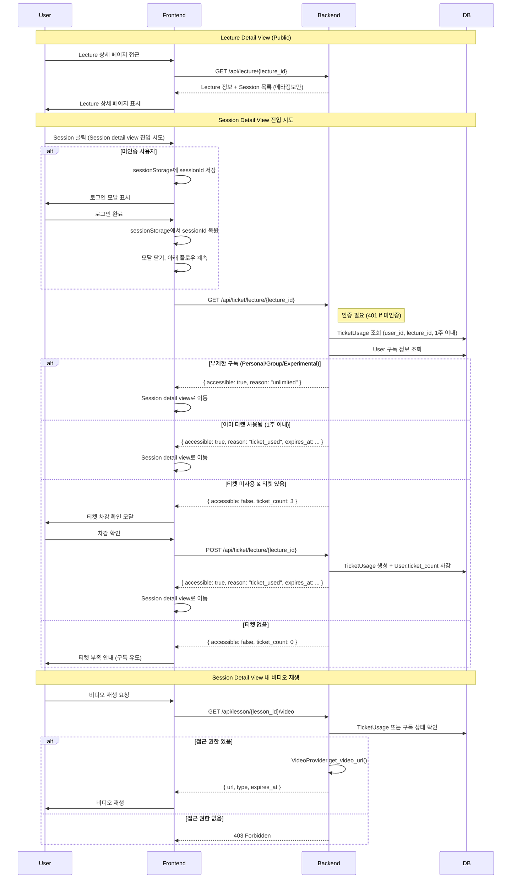

# Lecture

하나의 곡에 대한 강의 모음, 또는 특정 주제로 기획된 강의 시리즈입니다.

- 여러 개의 Session으로 구성됨 (약 10개 내외)
- 곡 단위 또는 주제별로 기획

## 접근 권한

| 페이지         | 비로그인         | Ticket Plan        | 무제한 구독 |
| -------------- | ---------------- | ------------------ | ----------- |
| Lecture 목록   | ✅               | ✅                 | ✅          |
| Lecture detail | ✅               | ✅                 | ✅          |
| Session detail | ❌ (로그인 유도) | 티켓 차감 후 접근  | ✅          |
| 비디오 재생    | ❌               | 티켓 사용된 경우만 | ✅          |

## 티켓 시스템

### 티켓 차감 플로우

### 미인증 사용자 처리

미인증 상태에서 Session 클릭 시:

1. **Pending Session 상태 저장**
   - `sessionStorage.setItem('pendingSessionId', sessionId)`로 클릭한 Session ID 저장
   - 로그인 완료 후 티켓 차감 플로우를 자동으로 재개하기 위함

2. **로그인 완료 후 자동 재개**
   - 페이지 마운트 시 (`onMount`) `sessionStorage`에서 `pendingSessionId` 확인
   - 저장된 Session ID가 있으면 티켓 차감 플로우 자동 재개
   - 처리 완료 후 `sessionStorage`에서 해당 값 제거

3. **401 에러 처리**
   - 티켓 접근 확인 API 호출 시 401 에러 발생 시 로그인 모달 표시
   - `sessionStorage`에 현재 Session ID 저장 후 로그인 유도

### 티켓 유효 기간

- 티켓 사용 시 해당 Lecture에 대해 **1주간** 접근 가능
- 1주 후 만료되면 다시 티켓 차감 필요

### 무제한 구독 판단 기준

- `subscription.name` in ["personal", "group", "experimental"]
- `subscription.is_active` = true
- `user.expires_at` > now (만료되지 않음)
